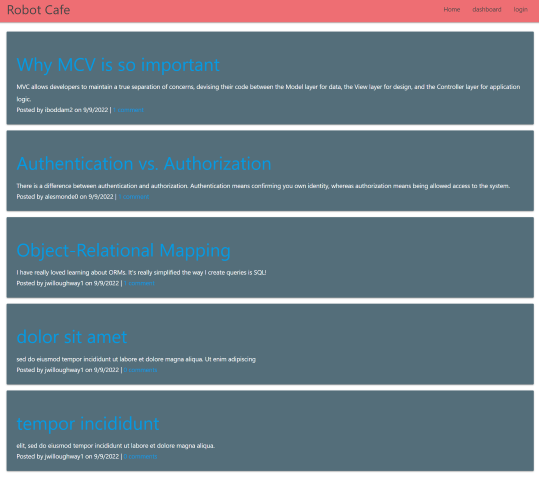
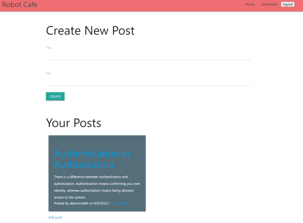

# Robo-Cafe

## Description

AS A developer who writes about tech

I WANT a CMS-style blog site

SO THAT I can publish articles, blog posts, and my thoughts and opinions

## Table of Contents

- [Usage](#usage)
- [Technologies](#technologies)
- [Start the application](#commands-to-start-the-application)
- [Screenshots](#screenshots)
- [Questions](#questions)

## Usage

<a href="https://shielded-shore-98209.herokuapp.com/">Robot Cafe</a>

## Technologies

- NodeJS
- Handlbars
- Sequelize
- MySQL
- Materialize

## Commands to start the application

### Running on local host

- Seed the application:
  - npm run seeds
- Start the application:
  - npm start

## Screenshots

**Landing page**

**User Dashboard**

## Questions

**How to reach me**

- <a href="https://github.com/joesen-dev">Joseph</a>
